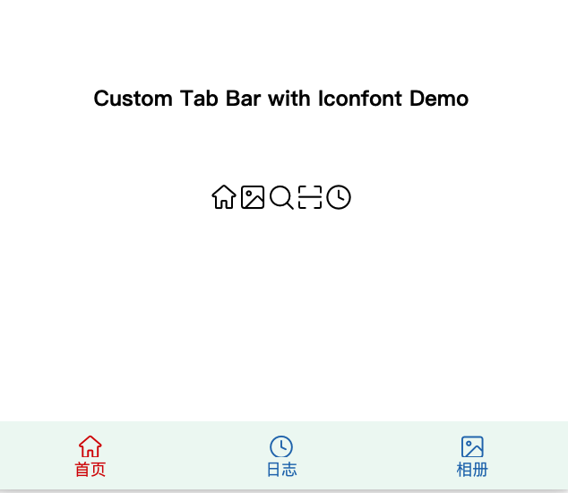
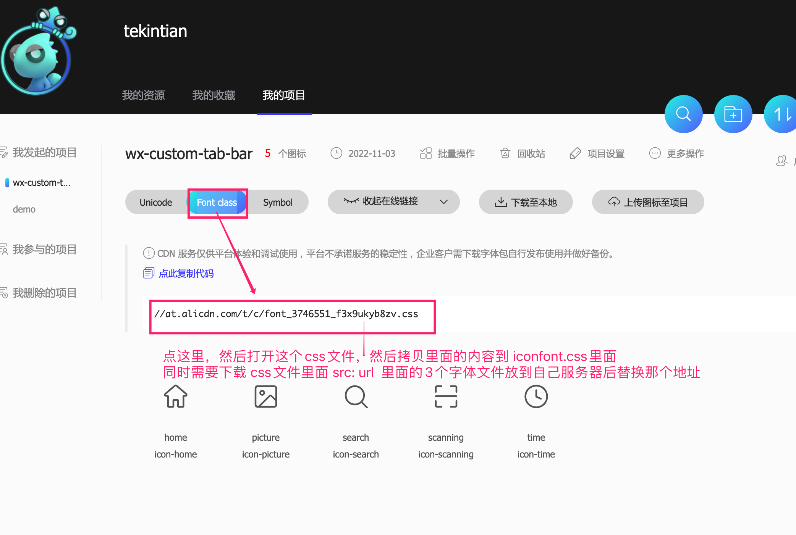
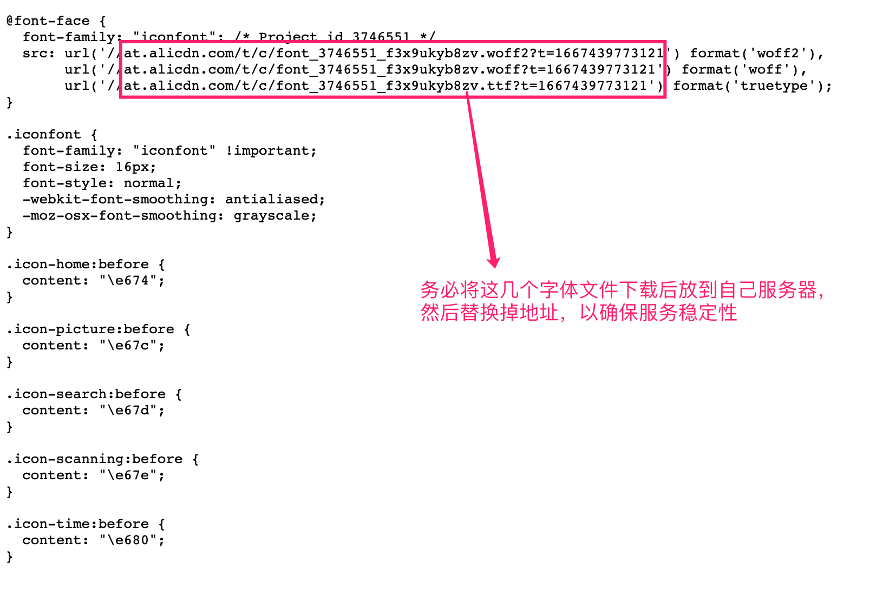

# 微信小程序使用 iconfont图标自定义tab-bar导航

可使用所有可用的在线图标资源来自定义自己的微信小程序tab-bar样式，可自定义选中tab颜色，字体和大小，使用远程字体样式文件， 可极大的缩减小程序的体积。 同时可以和本地项目中的其他图标资源共享。

各种企业信息化软件，小程序定制开发联系QQ：932256355

## 使用法法

## 第一步
在app.json中增加以下内容， 注意 list里面的 pagePath 必须指定，text可以忽略
~~~json
  "tabBar": {
    "custom": true,
    "color": "#7A7E83",
    "selectedColor": "#3cc51f",
    "borderStyle": "black",
    "backgroundColor": "#fff",
    "list": [
      {
        "pagePath": "pages/index/index",
        "text": "首页"
      },
      {
        "pagePath": "pages/logs/logs",
        "text": "日志"
      },{
        "pagePath": "pages/picture/index",
        "text": "Picture"
      }
    ]
  },
~~~

## 第二步
拷贝 custom-tab-bar 文件夹到你的小程序app.json所在的目录

## 第三步 获取 iconfont样式内容
到 https://www.iconfont.cn/  或者谷歌字体库中挑选你自己喜欢的字体，然后下载相关的字体样式和字体文件，

并将你获取到的iconfont.css里面的样式代码拷贝到  assets/iconfont.wxss 文件中

- 示例

## 修改tab绑定的样式

到 custom-tab-bar/index.js 文件中 data list 数据里面修改自己的 tab名称，路径和样式数据

~~~js
    list: [
      {
        "pagePath": "/pages/index/index", // tab页面路径
        "text": "首页", // 这个是tab显示名称
        "iconClass": "icon-home" // icon-home 这个就是你在第三方获取的图标样式代码 根据实际修改
      },
      {
        "pagePath": "/pages/logs/logs",
        "text": "日志",
        "iconClass": "icon-time"
      },{
        "pagePath": "/pages/picture/index",
        "text": "相册",
        "iconClass": "icon-picture"
      }
    ]
  },
~~~

如果要自定义tab的样式，可到 custom-tab-bar/index.wxss 里面做相应的调整。

Ok！

各种企业信息化软件，小程序定制开发联系QQ：932256355   tekintian@gmail.com

## 完整效果图

